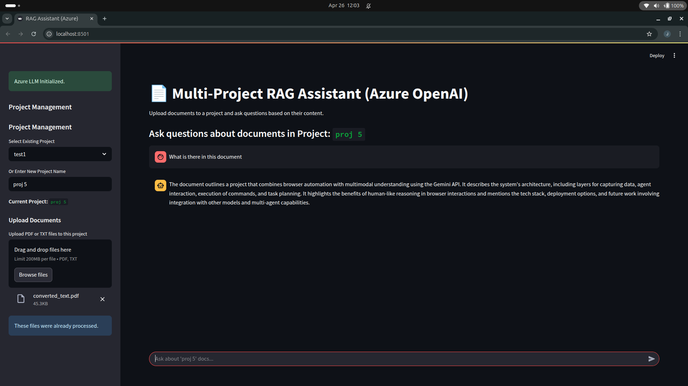
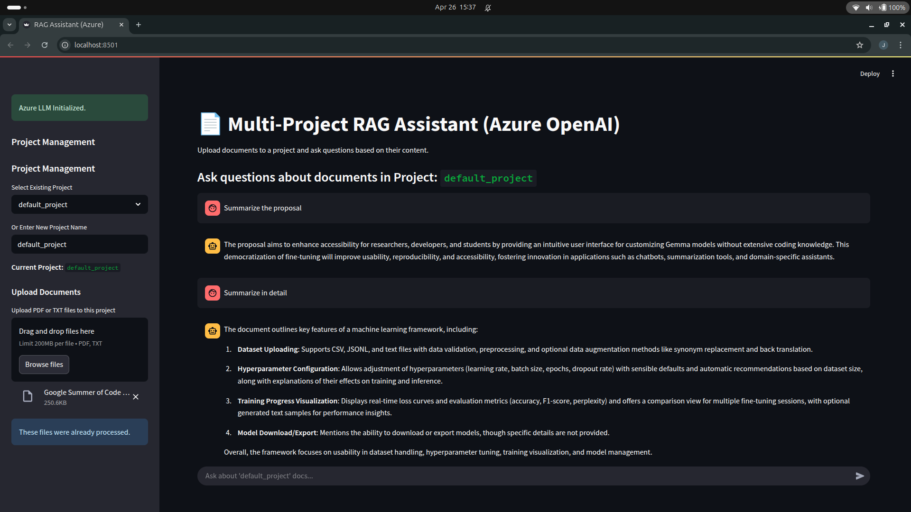
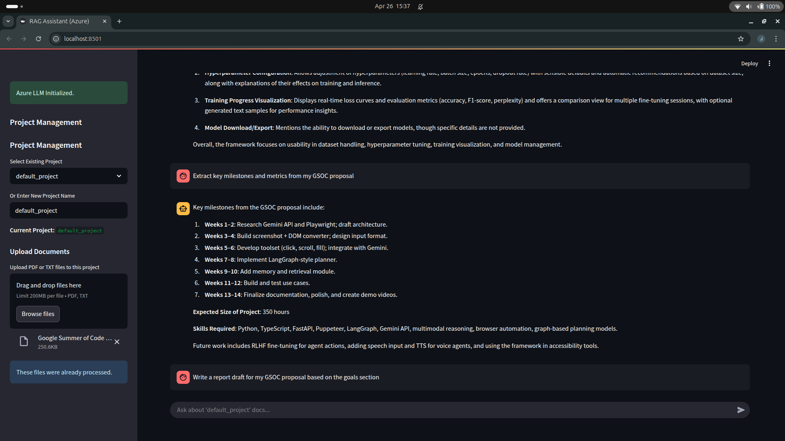

# 📄 Smart AI Research Assistant

A lightweight AI-powered assistant to **analyze documents** and **autonomously act** using tools.

Built with:
- ⚡ Azure OpenAI
- ⚡ LangChain
- ⚡ FAISS
- ⚡ Streamlit

---

## ✨ Features

- **RAG-Based QA**: Upload PDFs/TXTs and ask document-specific questions.
- **Multi-Project Management**: Separate projects with independent document sets.
- **Agentic AI**: Auto-uses tools like summarize, extract KPIs, generate reports, and search web.
- **Simple Streamlit UI**: Upload files, manage projects, and chat.

---

## 🚀 Quick Setup

1. **Clone Repository**:

```bash
git clone https://github.com/samyakshrma/smart-ai-research-assistant.git
cd smart-ai-research-assistant
```

2. **Install Requirements**:

```bash
pip install -r requirements.txt
```

3. **Configure Azure OpenAI** (`.env`):

```
azure_endpoint="your-endpoint-here"
azure_api_key="your-api-key-here"
azure_api_version="your-api-version-here"
azure_chat_deployment="your-chat-deployment-name-here"
azure_embedding_deployment="your-embedding-deployment-name-here"

```

4. **Run the App**:

```bash
streamlit run app.py
```

---

## 🧠 How It Works

| Step | What Happens |
|-----|--------------|
| Upload Documents | Chunked and stored in FAISS vector database. |
| Ask Questions | Retrieves relevant chunks and uses Azure OpenAI to answer. |
| Special Requests | Agent decides if a tool (summarize, extract KPIs, etc.) is needed. |

---

## 📷 Demo

- Upload docs → Select/Create project → Ask questions → Get smart responses!




---

# 🎯 Smart Research Starts Here.
